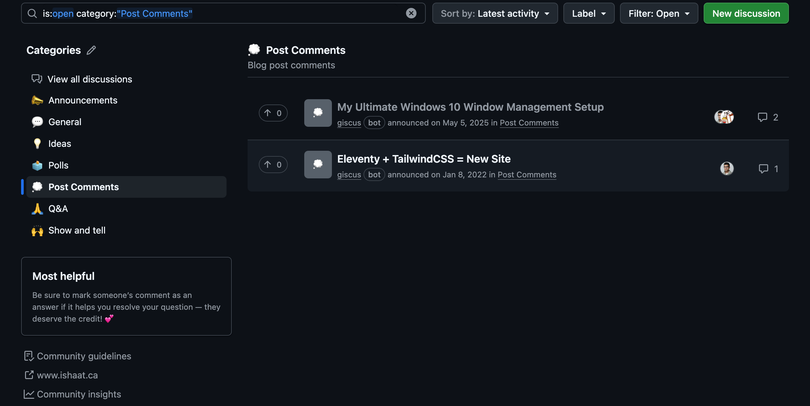

## Introduction

Recently, I've been using Quarto at work to author design docs and other documents and really fell in love with it. I loved how expressive Pandoc markdown was compared to other forms of markdown and how many output formats Quarto supported: HTML, DOCX, PDF, and more. At work I mainly used it to author single documents: PDF, DOCX, and a single HTML page.

At the same time, I had been maintaining my personal site for several years now. I occasionally write posts (once a year at best). But whenever I do, I end up having to spend time maintainig my static site generation stack (Eleventy + TailwindCSS + whatever other NodeJS tools that brought along) instead of actually focusing on writing the content. As my site used to be a NodeJS project, sometimes I had to deal with node module issues whenever I wanted to ensure that I can even preview/build it using Eleventy.

Since Quarto can be used to host a blog @quarto-blog and I already really liked using it to write techincal documents, I decided it was time to migrate my blog to Quarto from Eleventy and TailwindCSS.

Lastly, I had a resume that I had hosted on Overleaf.com which was written in LaTeX and based on Jake's resume. I wanted to update my resume and also make it part of my website somehow. I found that I had a hard time even maintaining the resume in Overleaf since I didn't use the site for anything else, I didn't really like LaTeX or understand it very well (which made my resume hard to maintain), and wanted a more local editing experience. Quarto can handle LaTeX but that would require downloading LaTeX dependencies which is a pain. However, it also vendors Typst @quarto-typst (which is a modern LaTeX replacement) and there was a Typst resume template @basic-resume that was similar to Jake's resume.

## Why Quarto?

I wanted to write longer, more academic style blog posts which could make use of formal citations if I wanted to. I want to write in this more rigorous style since I'm finding that I scrutinize anything I read far more heavily than ever with the ubiquity of LLMs. Considering how easily information can be fabricated/hallucinated/whatever nowadays, I want to source claims I make in my writing as much as possible so that readers can more easily verify what I say. I refuse to allow an LLM to write for me as I find LLM generated content tortortous to read through due to lack of information density. But I do find LLMs help me in challenging specific claims I make and also helping with collecting interesting, relevant articles for me to read through. I don't use LLMs to write, I use it more like a lightweight editor and research assistant.

Quarto natively supports citations @quarto-citations in almost any citation style you want to use. I use IEEE style for this blog as it just renders inline in the text as `[1]` and just appends a simple list as a bilbiography at the end. Most of what I'll be citing is online sources, so I thought this was a good fit for a technical blog. Standard Markdown dosn't have a citation syntax. But you could get something like it manually using footnotes but you have to handle the numbering yourself. With Quarto's native citation support, you keep your sources in a single bibtex file and you cite it inline in your document with this syntax `@source-key`. All of the numbering is done for you. I find it really handy to keep my research separate from my document/post. I often give an LLM a link to a webpage and ask it to add it to the bibtex file for me so I don't have to manage the bibtex file by hand. The thing about using formal citations is that I can easily refer to the same source multiple times quite easily and have Quarto handle the numbering. Lastly, I like the look of inline citations over use of direct hyperlinks. Probably direct hyperlinks are easier for readers of a blog.

Quarto is just a single executable @quarto-cli so it doesn't suffer from any NodeJS shenanigans. It has `preview` (similar to `eleventy --serve`) and `render` (similar to `eleventy --build`) commands which are the main ones you use to preview and build the blog post.

I've always struggled with making websites look nice as UI design is not my forte. I was able to kludge my way through it in the past, but at this point, I just want something that looks nice enough and mostly gets out of my way. Websites in Quarto are styled using Bootstrap. Quarto vendors 25 Bootswatch @bootswatch themes and supports light/dark theme pairing out of the box @quarto-themes. I use *flatly* as the light theme and *darkly* as the dark theme in this site. Although the site doesn't look as individual/unique to me as my old one, it's a sacrifice I'm willing to make to have more time to focus on writing.

## Site Structure

```{.sh #lst-site-structure lst-cap="Filesystem structure of the site"}
personal-site/
├── .github/
│   ├── prompts/
│   │   └── new-post.prompt.md
│   ├── skills/
│   ├── workflows/
│   │   └── publish.yml # Deployment action
│   └── copilot-instructions.md
├── assets/ # Shared assests for the site
│   └── favicon/
├── posts/ # Blog posts, have subfoler per year, each post within a year is prefixed by post number
│   ├── 2020/
│   │   └── 001-eleventy-tailwindcss-new-site/
│   │       └── index.qmd # Blog post content
│   ├── 2021/
│   │   └── 001-introducing-nvim-deardiary/
│   │       └── index.qmd # Blog post content
│   ├── 2023/
│   │   └── 001-my-ultimate-windows-10-window-management-setup/
│   │       ├── index.qmd # Blog post content
│   │       ├── *.png # Per-post assets are contained in the post directory
│   │       └── *.gif
│   ├── 2026/
│   │   └── 001-migrating-my-blog-to-quarto-from-eleventy-tailwindcss/ # Individual post
│   │       ├── notes/ # Research notes (not rendered)
│   │       │   └── example-note.md
│   │       ├── index.qmd # Blog post content
│   │       └── refs.bib # Bibliography (BibTeX) file
│   └── _metadata.yml # Shared frontmatter for all posts
├── scripts/
│   ├── new-post.sh # Create new post
│   ├── setup.sh # Setup local dev dependencies
│   └── sort-bib.py # Sort bibliography file lexically by citation key
├── 404.qmd # 404 page
├── LICENSE.md
├── README.md
├── _quarto.yml # Defines Quarto Website project
├── about.qmd # About page
├── ieee.csl # IEEE Citation Syntax Language
├── index.qmd # Site home page
├── mise.toml # Defines python and uv versions as long as wraps scripts in tasks
├── pyproject.toml # Defines which dependencies are needed in this site
├── resume.typ # Typst source for the resume PDF
├── styles.css # Custom CSS Styles used by Quarto (currently empty)
└── uv.lock # Lock file for python dependencies
```

The above listing shows the basic filesystem structure of the Quarto project that hosts this website. It's mostly pretty straightforward imo and the inline comments describe the files pretty well, so won't elaborate much more.

```{.yml #lst-quarto-yml lst-cap="Contents of _quarto.yml"}
project:
  type: website
  output-dir: _site
  pre-render:
    - quarto typst compile resume.typ
  render:
    - "*.qmd"
    - "posts/**/*.qmd"
  resources:
    - "assets/favicon/**"
    - resume.pdf

website:
  # title: "Ishaat Chowdhury" # Intentionally not set
  site-url: "https://www.ishaat.ca"
  favicon: assets/favicon/favicon.ico
  open-graph:
    site-name: "Ishaat Chowdhury"
  twitter-card: true
  navbar:
    title: "Ishaat Chowdhury"
    right:
      - about.qmd
      - text: Resume
        href: resume.pdf
      - icon: rss
        href: index.xml
  page-footer:
    center: "© 2026 Ishaat Chowdhury"
    right:
      - icon: github
        href: https://github.com/ishchow/personal-site
        aria-label: Source Code
      - icon: linkedin
        href: https://ca.linkedin.com/in/ishaatc
        aria-label: LinkedIn
      - icon: envelope
        href: mailto:ishaatchowdhury@gmail.com
        aria-label: Email

format:
  html:
    theme:
      light: flatly
      dark: darkly
    css: styles.css
    include-in-header: assets/favicon/head.html
```

This is the definition of the Quarto project. It's a website type project which before we run `quarto render` will compile `resume.typ` to `resume.pdf`. The blog posts are in `posts/**/*.md` and other pages (404, about, etc) are in `*.qmd` files which are rendered as part of `quarto render`. The rest is pretty straightforward imo and thus won't detail. Refer to Quarto docs for more information.


```{.yml #lst-example-post-frontmatter lst-cap="Example Post Frontmatter"}
---
title: "Migrating My Blog to Quarto from Eleventy + TailwindCSS"
date: "2026-03-18"
description: "TODO: Fill in description"
draft: true
categories: [ssg, quarto]
bibliography: refs.bib
---
```

Above is the frontmatter for this post. It's pretty straightforward imo.

### Site Title Handling and Implications for Giscus

The reason why have this `# title: "Ishaat Chowdhury" # Intentionally not set` in `_quarto.yml` is that when you enable title on the site, the actual page in the HTML becomes something like `{page.title} – {website.title}` but if you comment it out, the title becomes `{page.title}`. Under the hood, Quarto uses the `website.title` value as Pandoc's `title-prefix` @pandoc-title-prefix, which gets appended to the page title in the HTML `<title>` tag. You can see this in Quarto's `computePageTitle` function @quarto-compute-page-title shown in @lst-compute-page-title. My original Eleventy blog had giscus setup that it created a GitHub discussion entry for `{page.title}`. So when I set `title:`, this was causing Quarto to not pickup my existing discussion entries since my discussion entries @fig-gh-disc don't have the `– Ishaat Chowdhury` site title suffix which thus broke comments in my site. After commenting out `title:`, everything started working again. This was the most frustrating and subtle issue with the migration imo and it would've been pretty annoying to figure this out without the help of LLMs. Because I used LLMs to figure this out, I will fully admit that I might've missed something and picked a suboptimal workaround for this. I mostly just wanted to get it working and move on with my life but if someone who is reading this knows the proper way to fix this, please let me know!

```{.typescript #lst-compute-page-title lst-cap="Quarto's computePageTitle function from website-shared.ts"}
export function computePageTitle(
  format: Format,
  extras?: FormatExtras,
): string | undefined {
  const meta = extras?.metadata || {};
  const pageTitle =
    meta[kPageTitle] || format.metadata[kPageTitle];
  const titlePrefix =
    extras?.pandoc?.[kTitlePrefix] ||
    format.pandoc[kTitlePrefix] ||
    (format.metadata[kWebsite] as
      Record<string, unknown>)?.[kTitle];
  const title = format.metadata[kTitle];

  if (pageTitle !== undefined) {
    return pageTitle as string;
  } else if (titlePrefix !== undefined) {
    if (titlePrefix === title) {
      return title as string;
    } else if (title !== undefined) {
      return title + " – " + titlePrefix;
    } else {
      return titlePrefix + "";
    }
  } else {
    return title as string;
  }
}
```

{#fig-gh-disc}

## Authoring Posts

### Post Scaffolding

I use a small shell script to scaffold new posts. It picks the current year, finds the next post number within that year, slugifies the title, and creates an `index.qmd` file with basic frontmatter. I wrap calling it in a prompt.

```{.md #lst-new-post-prompt lst-cap="new-post.prompt.md"}
```

### Merging Changes to the Post

```{.md #lst-merge-post-prompt lst-cap="merge-post.prompt.md"}
TODO: Add the prompt and then inline here!
```

## Updating Resume

Basically update the `resume.typ` file. The basic-resume template @basic-resume is much easier to read and maintain than the Jake's resume LaTeX template I was using before while giving the same look. Run the below commands to compile the resume to PDF:

```bash
# Compile for deployment (no phone number)
quarto typst compile resume.typ

# Compile locally with phone number
quarto typst compile resume.typ --input phone=XXX-XXX-XXXX
```

In the CI, the resume won't have my phone number. But I can easily generate a version with my phone number and other private info in the future by adding it as an input. By default, if nothing is set for a private field, it won't be added to the PDF output.

## Porkbun + Netlify to Cloudflare Domains + Pages

I hosted my domain on Porkbun @porkbun and used Netlify @netlify to host the site. I have no issues really with either site. I also just bought a few domains on Cloudflare for some other websites and since Cloudflare also has pages @cloudflare-pages which is similar to Netlify, I used Cloudflare Pages on those other webistes for simplicity. I just migrated this website domain and hosting to Cloudflare to keep my domains + sites in one place using one stack.

The domain transfer process from Porkbun to Cloudflare Domains was pretty simple. As was the migration from Netlify to Cloudflare Pages.

### Redirecting old urls to new ones using bulk redirects

TODO: Mention how I used bulk redirects to migrate the 3 existing blog posts I had.

Not being a prolific writer (yet) actually ended up working out in my favor here.

## Deployment Pipeline

Pretty much a typical JAMStack setup.

First, I write locally on my laptop, create a new branch and files for my post, author using a text editor, and then make a PR when I want to publish a post.

Then, I have a single `deploy` GitHub Action that builds the site using Quarto's offical GitHub Action @quarto-actions and puts the output to a `_site/` folder. Afterwards, the Cloudflare Pages GitHub Action @cloudflare-pages-action deploys the contents of `_site/` to Cloudflare Pages infra. Finally, another GitHub action runs which can put a stick comment in a PR that has the links to deploy preview url(s). The same workflow runs on pushes to the default branch minus the PR comment action.

```{.yaml}
name: Deploy to CloudFlare Pages

on:
  push:
    branches: [master]
  pull_request:

permissions:
  contents: read
  deployments: write
  pull-requests: write

jobs:
  deploy:
    runs-on: ubuntu-latest
    steps:
      - uses: actions/checkout@v4

      - name: Install Quarto
        uses: quarto-dev/quarto-actions/setup@v2

      - name: Render site
        run: quarto render

      - name: Deploy to CloudFlare Pages
        id: deploy
        uses: cloudflare/pages-action@v1
        with:
          apiToken: ${{ secrets.CLOUDFLARE_API_TOKEN }}
          accountId: ${{ secrets.CLOUDFLARE_ACCOUNT_ID }}
          projectName: personal-site
          directory: _site
          gitHubToken: ${{ secrets.GITHUB_TOKEN }}

      - name: Comment preview URL on PR
        if: github.event_name == 'pull_request'
        uses: marocchino/sticky-pull-request-comment@v2
        with:
          header: cloudflare-preview
          message: |
            ## ☁️ Cloudflare Pages Deploy

            | | |
            |---|---|
            | **Latest commit:** | `${{ github.event.pull_request.head.sha }}` |
            | **Status:** | ✅ Deploy successful! |
            | **Preview URL:** | ${{ steps.deploy.outputs.url }} |
            | **Branch Preview URL:** | ${{ steps.deploy.outputs.alias }} |
```

Although CloudFlare Pages can build sites directly from source, Quarto isn't one of it's supported static site generators. You can technically use a custom build command which can download Quarto CLI from GitHub releases via wget or curl and then run the CLI to build the site. That seemed really janky. Cloudflare supports deploying any static output @cloudflare-pages-static-html which is the official GitHub action does. So opted to go with the GitHub actions approach instead as it seemed less brittle and more flexible.

I personally like having Cloudflare Pages just be a pure deployment target but I control the build logic entirely with GitHub Actions. It makes it easy to move static site hosts in the future if I don't depend on my host to also do CI/CD. I could technically migrate away from GitHub to another forge as long as I can host the code there (which is a trivial capability) and the forge has support for CI/CD which can deploy to Cloudflare (less trivial likely). Overall, to me at least, it feels like a pretty clear separation of concerns.

## Result

TODO: ???